# 基于 Spark 的微服务推荐系统
## 组件选择
|  功能   | 选择   |
| :----:  | :----: |
| 服务注册 | Nacos  |
| 服务发现 | Nacos  |
| 服务降级 | Sentinel |
| 服务熔断 | Sentinel |
| 服务调用 | Feign |
| 服务网关 | Spring Cloud Gateway |
| 数据库   | MongoDB |
| 缓存数据库 | Redis |
| 消息队列 | Kafka |
| 全文索引 | ElasticSearch |
| 离线推荐 | Spark MLlib |
| 离线统计 | Spark SQL |
| 流式计算 | Spark Streaming |

## 微服务架构

## 推荐系统架构

## 注册
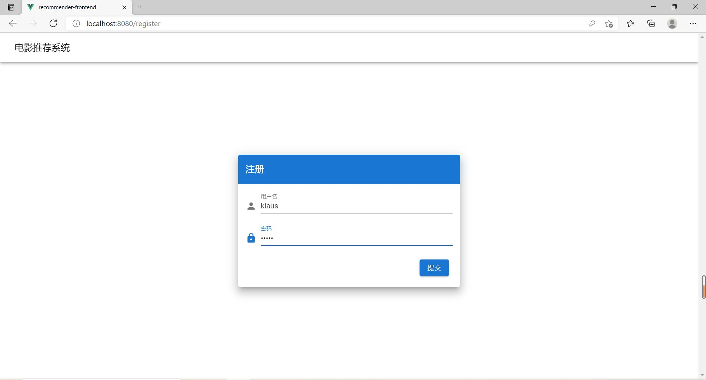

## 登录
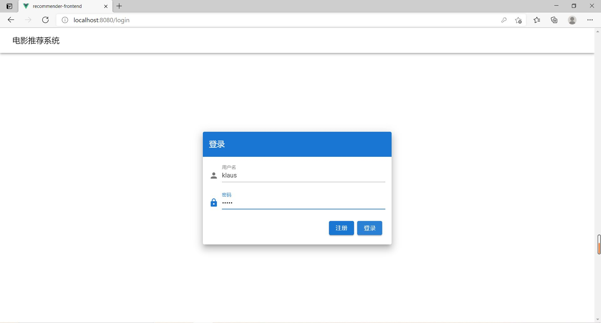

## 冷启动
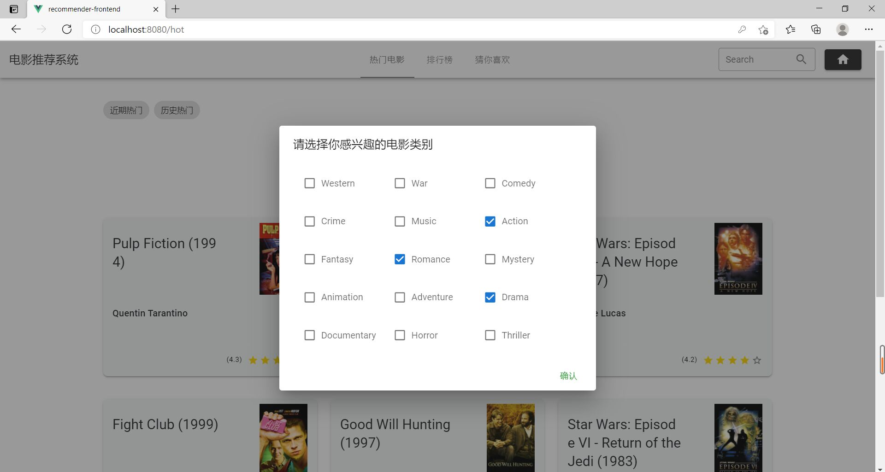

## 近期热门
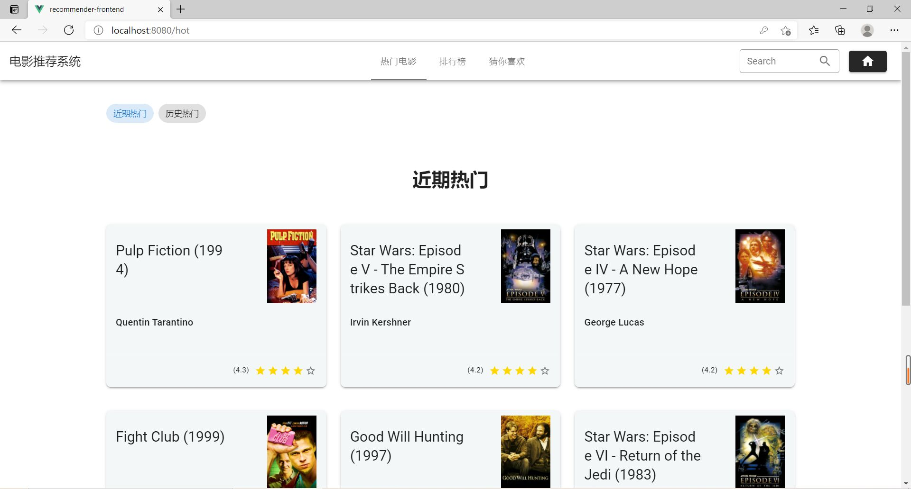

## 历史热门
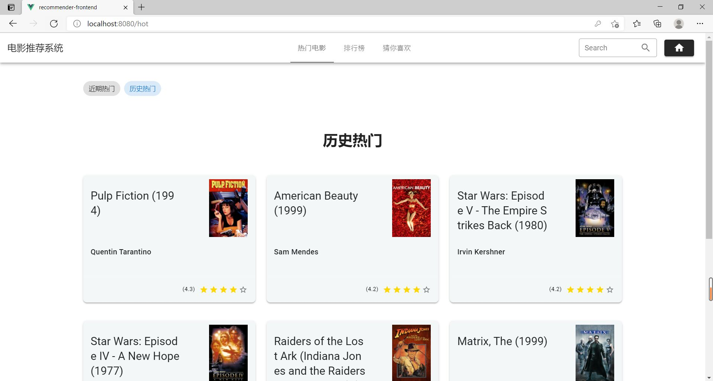

## 电影详情页
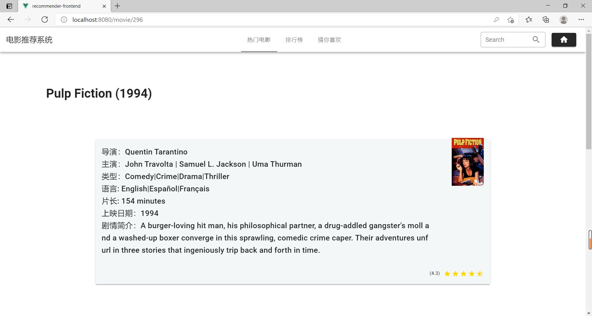

## 相似电影
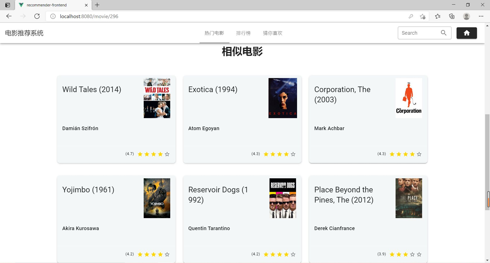

## 排行榜
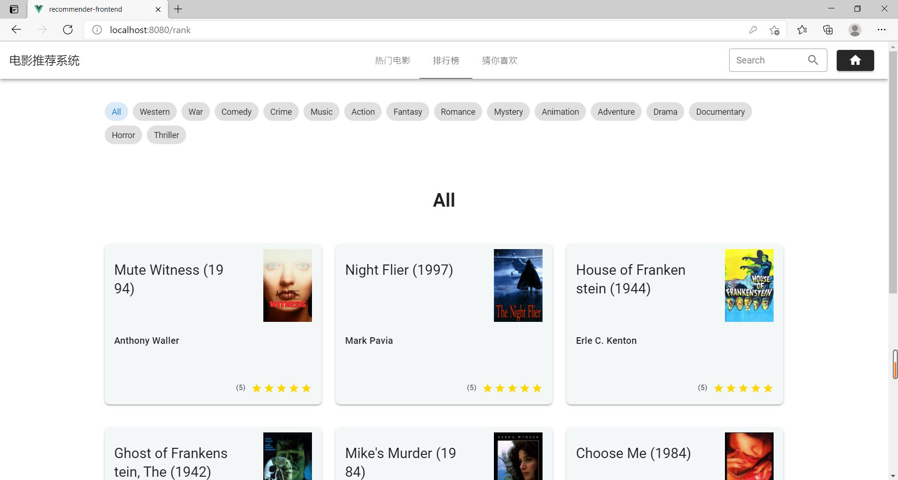

## 分类排行榜
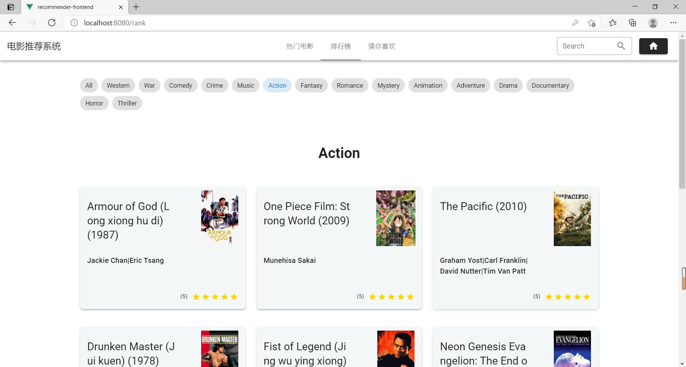

## 猜你喜欢
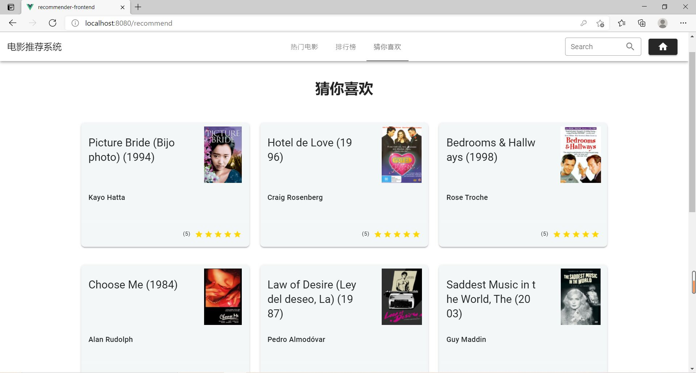

## 实时推荐
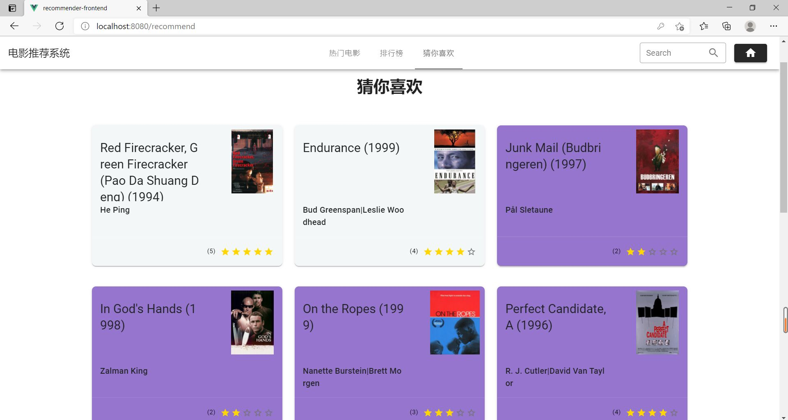

## 前端
使用了 Vue + Vuetify，详情见
[推荐系统前端](https://github.com/EnableAsync/recommender-frontend)
